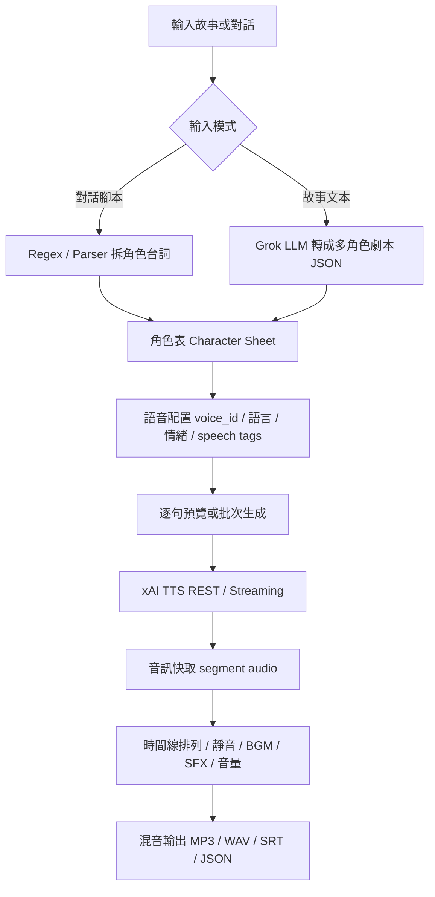

# plan.md — Grok 多角色語音生成配音 App 開發計畫

> 專案名稱建議：**Grok Voice Studio**  
> 目標：做一個有 GUI 的桌面配音工具，可以直接輸入「對話」或「故事」，自動拆成多角色台詞，使用 Grok / xAI TTS 產生語音，並支援多角色、多語言、預覽、批次生成、時間線混音與輸出。

---

## 0. 依據與前提

本計畫以 xAI 官方 Voice / TTS 文件為基礎，並預留可插拔 Provider 架構。

已確認的 xAI 能力（2026-07-01 檢查）：

- REST TTS：`POST https://api.x.ai/v1/tts`
- Streaming TTS：`wss://api.x.ai/v1/tts`
- 取得語音清單：`GET https://api.x.ai/v1/tts/voices`
- 單次文字上限：官方文件標示 TTS text 最大 15,000 characters
- 支援 inline speech tags：例如 `[pause]`, `[laugh]`, `[sigh]`, `[breath]` 等
- 內建 voice fallback：`eve`, `ara`, `rex`, `sal`, `leo`
- Custom Voice：可用 `voice_id` 用於 TTS / Streaming / Voice Agent API，但必須遵守聲音授權與驗證流程

官方來源：

- https://docs.x.ai/developers/rest-api-reference/inference/voice
- https://docs.x.ai/developers/model-capabilities/audio/voice
- https://x.ai/news/grok-custom-voices

---

## 1. 技術選型

### 1.1 推薦主架構

採用：

- **GUI**：Tauri v2 + React + TypeScript
- **Backend**：Rust
- **資料庫**：SQLite
- **音訊處理**：FFmpeg CLI 優先，後續可逐步替換為 Rust crate
- **TTS Provider**：xAI Grok TTS 作為第一 Provider
- **LLM 劇本整理**：xAI Grok Chat / OpenAI-compatible Chat endpoint 或可插拔 LLM Provider

選 Tauri 而不是純 egui 的原因：

- 劇本編輯器、表格、角色面板、時間線、多檔案管理較容易做出現代 GUI。
- Rust backend 可以安全處理 API key、音訊快取、檔案輸出。
- Windows 桌面體驗好，未來也可打包 macOS / Linux。

### 1.2 備選架構

- **Rust egui / eframe**：適合快速原生 MVP，但複雜 timeline / script editor 會比較吃力。
- **Electron + Node.js**：開發快，但體積大，且與你的 Rust 生態整合較弱。
- **Python + PySide6**：AI 快速原型容易，但長期打包與音訊 pipeline 較難維護。

---

## 2. App 核心流程



---

## 3. 開發里程碑

### Milestone 1 — MVP：可用的桌面配音工具

目標：能輸入多角色對話，選 voice，生成每句語音，合併輸出。

功能：

- 專案建立 / 開啟 / 儲存
- API Key 設定，儲存在 OS keychain 或本地加密設定
- 角色管理：角色名稱、voice_id、語言、情緒備註
- 劇本編輯器：支援 `角色: 台詞` 格式
- 一鍵解析成 segments
- 呼叫 xAI `POST /v1/tts`
- 每句音訊快取
- 播放單句 / 播放整段
- 使用 FFmpeg concat / filter_complex 合併輸出
- 輸出 WAV / MP3

驗收標準：

- 能完成 3 個角色、30 句台詞的配音輸出。
- 同一段台詞重複生成時命中快取，不重複扣 API。
- 錯誤時能顯示是哪一句失敗，可重試單句。

---

### Milestone 2 — Story Mode：故事自動轉多角色劇本

目標：貼上一段故事，自動分析角色、旁白、台詞，產出可編輯的多角色劇本。

功能：

- Story Mode 輸入全文
- 使用 Grok LLM 轉換為 `DubbingScript JSON`
- 自動建立角色表
- 使用者可手動修正角色名稱、句子、情緒、語速提示
- 支援「旁白」角色
- 支援每句 speech tags：例如 `[pause]`, `[sigh]`, `[laugh]`

驗收標準：

- 500～3000 字中文故事可轉成分段台詞。
- 結果可手動編輯再生成。
- 不會把所有內容塞進單一角色。

---

### Milestone 3 — GUI 進階：時間線、多軌、波形、字幕

目標：從簡單合併音訊升級成配音剪輯工具。

功能：

- 多軌 timeline：旁白軌、角色軌、BGM 軌、SFX 軌
- waveform 顯示
- 每句拖拉排序、調整間隔、淡入淡出
- 每句音量、左右聲道 pan
- BGM / SFX 匯入
- 自動產生 SRT / VTT 字幕
- 匯出 project bundle

驗收標準：

- 能輸出含旁白、角色、背景音樂的完整音檔。
- 字幕時間碼與語音段落接近一致。
- GUI 操作不阻塞，生成過程有 progress queue。

---

### Milestone 4 — Provider Plugin：多 TTS 引擎

目標：不要被單一供應商綁死。

Provider：

- xAI Grok TTS
- OpenAI-compatible TTS
- ElevenLabs
- Azure Speech
- Local TTS：VoxCPM / Qwen TTS / Piper / Coqui

設計：

```rust
#[async_trait::async_trait]
pub trait TtsProvider {
    async fn list_voices(&self) -> Result<Vec<VoiceInfo>>;
    async fn synthesize(&self, req: TtsRequest) -> Result<TtsResult>;
    async fn synthesize_stream(&self, req: TtsRequest) -> Result<AudioStream>;
}
```

驗收標準：

- 不改 GUI 即可切換 Provider。
- 每個角色可指定不同 Provider。
- Provider 失敗時可 fallback。

---

### Milestone 5 — Production：封裝、穩定、安全

功能：

- Windows installer
- 自動更新
- crash report
- API key 保護
- custom voice 授權提示與記錄
- rate limit / retry / backoff
- 任務佇列持久化
- 匯出 log bundle 方便 debug

驗收標準：

- Windows 10/11 可安裝執行。
- 1000 句長劇本可分批生成。
- 中途關閉 app 後重開可恢復任務。

---

## 4. 建議資料夾結構

```txt
grok-voice-studio/
  apps/
    desktop/                  # Tauri + React GUI
      src/
      src-tauri/
  crates/
    core/                     # domain models, parser, project format
    providers/
      xai/                    # xAI Grok TTS provider
      openai_compat/
      local_tts/
    audio/                    # ffmpeg wrapper, waveform, mixdown
    script_engine/            # story/dialog parser, LLM transform
    storage/                  # SQLite, cache, migrations
  docs/
    plan.md
    spec.md
    todos.md
    test.md
    final.md
  examples/
    demo_story.zh.txt
    demo_dialogue.zh.txt
  assets/
```

---

## 5. 推薦開發順序

1. 建立 project format：`project.json + assets/`
2. 做 dialogue parser：`角色: 台詞`
3. 做 xAI TTS REST provider
4. 做音訊快取
5. 做 Tauri GUI：角色表 + 劇本編輯 + 生成按鈕
6. 做播放與輸出
7. 加 Story Mode / Grok LLM 整理
8. 加 timeline 與字幕
9. 加 Provider plugin
10. 打包 Windows installer

